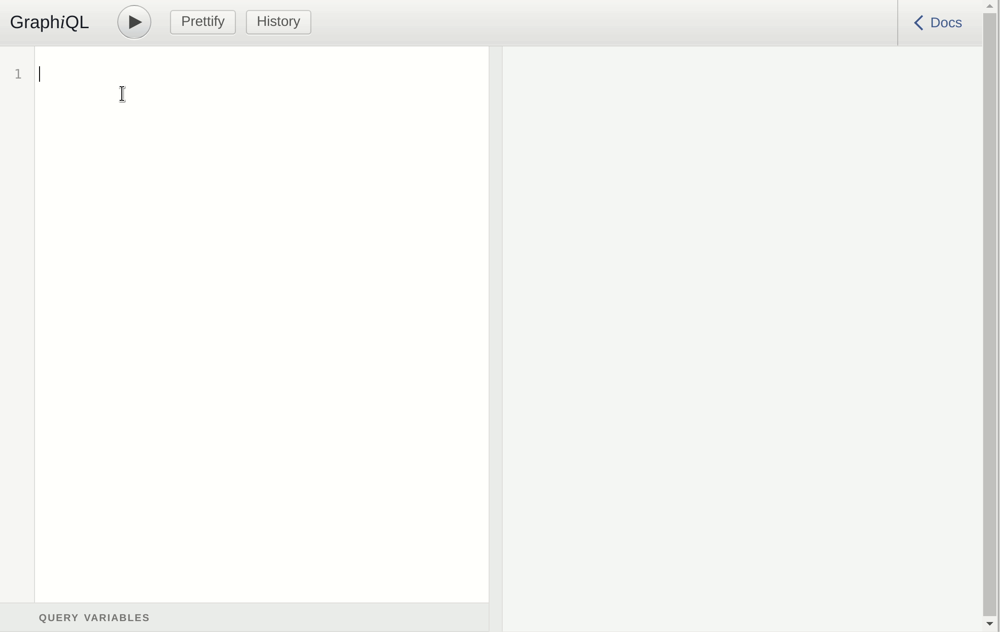

# gitbase-graphql

A [GraphQL](http://graphql.org/) API on top of [gitbase](https://github.com/src-d/gitbase).

This is a proof of concept.



## Requirements

You will need a running [gitbase](https://github.com/src-d/gitbase) with some data.

_Note_: Some of the functionality will only work if you run the latest master branch of gitbase.

```bash
wget https://github.com/src-d/gitquery/releases/download/v0.10.0/gitquery_v0.10.0_linux_amd64.tar.gz
tar xzvf gitquery_v0.10.0_linux_amd64.tar.gz
cd gitquery_linux_amd64/
mkdir repos
cd repos
git clone https://github.com/src-d/gitbase.git
git clone https://github.com/src-d/engine.git
git clone https://github.com/src-d/ml.git
cd ..
./gitquery server -g repos
```

## Usage

Clone this repo, and execute:

```bash
yarn install
yarn start
```

Then go to [http://localhost:3000/graphiql](http://localhost:3000/graphiql) and explore!

The command `yarn start` takes the following arguments:

| Argument | Default | Description |
| --- | --- | --- |
| `--listen-port` | `localhost` | Port where the GraphQL server server will listen |
| `--host` | `localhost` | Host where the gitbase server is listening |
| `--port` | `3306` | Port where the gitbase server is listening |
| `--user` | `root` | User name used for the gitbase server connection |
| `--password` | ` ` | Password used for the gitbase server connection |

## Support

All the gitbase tables have their equivalent in the [GraphQL schema](./data/schema.js).

The supported functions are:

* `is_remote` & `is_tag`: as `Ref.isRemote` and `Ref.isTag`
* `commit_has_blob`: as `Commits.blobs`
* `language`: as `TreeEntry.language`

## Examples

Some queries you can try:


```
{
  allRepositories {
    id
    remotes{
      name
      fetchUrl
    }
  }
}
```

```
{
  allRepositories {
    id
    refs {
      name
      isTag
      isRemote
    }
  }
}
```

```
{
  allRepositories {
    id
    refs(isTag: true) {
      name
      commits {
        authorName
        message
        blobs {
          hash
          treeEntries {
            name
            language
          }
        }
      }
    }
  }
}
```
